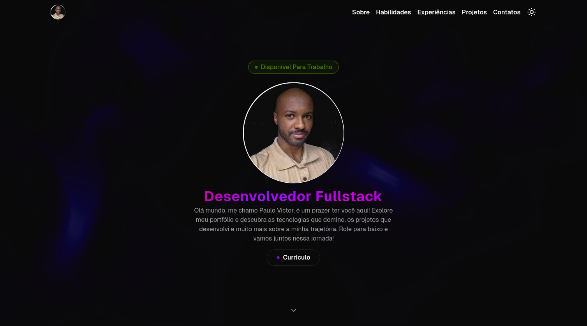

<p align="center">
  
  
  
</p>

<p align="center">
  
  
  
</p>

## Sobre o Projeto

Portfólio pessoal desenvolvido com **Next.js 16**, pensado para apresentar minha trajetória como desenvolvedor Fullstack.

O projeto reúne minhas principais tecnologias, experiências profissionais e acadêmicas, projetos desenvolvidos e formas de contato, tudo em uma única página (_single page_). A identidade visual prioriza leveza e sofisticação, com tema claro/escuro, animações e efeitos visuais interativos construídos com a biblioteca **Motion**.

## Demonstração 



> Imagem de demonstração

## Funcionalidades

- **Tema claro/escuro** — alternância suave via `next-themes`, com sincronização ao sistema operacional (`enableSystem`) e persistência em `localStorage`; atalhos de teclado `D` (dark) e `L` (light) para troca rápida
- **Transição animada de tema** — utiliza a API nativa `document.startViewTransition` com animação circular do ponto de clique (`clip-path`)
- **SEO completo** — metadata do Next.js App Router com título dinâmico, descrição, keywords, Open Graph (OG Image 1200×630), Twitter/X Cards e configuração de robots (index + follow + max-image-preview large)
- **Scroll suave** — `scroll-behavior: smooth` e `scroll-padding-top` para ancoragem precisa das seções com a navbar fixa
- **Navbar responsiva com glassmorphism** — ao rolar, aplica `backdrop-blur`, sombra e borda arredondada; colapsa para menu lateral (_Sheet_) no mobile
- **Seção Hero com fundo interativo (WebGL)** — efeito de fluido animado _Liquid Ether_ via WebGL (`ogl` + `three.js`) com cores personalizáveis
- **Animações de entrada com blur** — elementos da hero (badge, foto, título, descrição, botão) surgem com `motion/react` (Framer Motion v12) em sequência escalonada, com efeito de desfoque
- **Aurora Text** — título da hero com gradiente animado em loop (`@keyframes aurora`)
- **Badge "Disponível Para Trabalho"** — indicador visual com `animate-pulse`
- **Background de partículas dinâmico** — 130 partículas geradas em canvas que reagem ao tema (cor diferente no dark/light)
- **Carrossel de habilidades (Marquee)** — duas faixas com ícones SVG das tecnologias rolando em direções opostas (normal e reversa)
- **Seção de Experiências em Accordion** — entradas de formação acadêmica, experiências profissionais e idiomas exibidas em acordeão acessível, com ícones do `lucide-react`
- **Galeria de projetos com MagicCard** — cards com efeito de gradiente/glow que segue o ponteiro do mouse, exibindo imagem, descrição, badges de tecnologia e links para GitHub/deploy
- **Limite inteligente de tags em projetos** — exibe até 4 tags por projeto, com indicador de quantidade adicional quando há mais
- **Seção de Contato com Grainient** — background RGB animado com textura granulada via WebGL (`react-bits`)
- **Footer dinâmico** — ano gerado via `new Date().getFullYear()` e links sociais (GitHub, LinkedIn, Instagram, E-mail)
- **Design responsivo (Mobile First)** — layout adaptado para todas as telas; containers centralizados com classe utilitária `.main-container`
- **Fonte Geist** — carregada via `next/font/google` com variável CSS, zero CLS (Cumulative Layout Shift)
- **React Compiler ativado** — otimização automática de re-renders com `reactCompiler: true` no `next.config.ts`
- **Linting e formatação com Biome** — substituição do ESLint + Prettier, com organização automática de imports
- **TypeScript estrito** — `strict: true` no `tsconfig.json`; path alias `@/*` para `src/*`
- **Download do currículo** — botão CTA com link direto para documento no Google Docs

## Stack de Tecnologias

- **Next.js**: Framework React.
- **React 19**: Biblioteca de UI.
- **TypeScript**: Adiciona tipagem estática.
- **Tailwind CSS**: Framework de utilitários CSS.
- **shadcn/ui**: Componentes acessíveis pré-construídos.
- **Lucide**: Biblioteca de ícones SVG.
- **Motion (Framer)**: Animações declarativas.
- **Three.js**: Biblioteca 3D para WebGL.
- **OGL**: Wrapper leve para WebGL.
- **next-themes**: Gerenciamento de temas claro/escuro.
- **Biome**: Linting e formatação de código.
- **Vercel**: Plataforma de hospedagem e deploy.

## Estrutura de Pastas

```
portfolio/
├── public/
│   ├── demo/                      # GIFs e imagens dos projetos
│   │   ├── codelandia.jpg
│   │   ├── dogs.png
│   │   ├── flashdash.gif
│   │   ├── form-handler.gif
│   │   ├── lemon_peper.jpg
│   │   ├── movie_mate.jpeg
│   │   ├── rick-and-morty.jpg
│   │   ├── rick_morty.gif
│   │   ├── sass.gif
│   │   ├── velocity.png
│   │   └── zerou.gif
│   └── img/                       # Imagens gerais (foto, OG image)
│
├── src/
│   ├── app/
│   │   ├── favicon.ico
│   │   ├── globals.css            # Estilos globais, design tokens, keyframes
│   │   ├── layout.tsx             # Layout raiz com metadata SEO completa
│   │   └── page.tsx              # Composição da single page
│   │
│   ├── components/
│   │   ├── contact/
│   │   │   └── contact-content.tsx
│   │   ├── experience/
│   │   │   ├── experience-body.tsx
│   │   │   └── experience-header.tsx
│   │   ├── hero/
│   │   │   ├── animated-arrow-down.tsx
│   │   │   └── hero-content.tsx   # Badge, Image, Title, Description
│   │   ├── magic-ui/
│   │   │   ├── aurora-text.tsx    # Texto com gradiente animado
│   │   │   ├── interactive-hover-button.tsx
│   │   │   └── magic-card.tsx     # Card com efeito de glow/gradiente no cursor
│   │   ├── navbar/
│   │   │   ├── logo.tsx
│   │   │   ├── menu-desktop.tsx
│   │   │   ├── menu-mobile.tsx    # Menu lateral (Sheet) para mobile
│   │   │   └── navbar.tsx         # Navbar com glassmorphism ao scroll
│   │   ├── project/
│   │   │   ├── project-buttons.tsx
│   │   │   └── project-card.tsx
│   │   ├── react-bits/
│   │   │   ├── grainient.tsx      # Background RGB granulado via WebGL
│   │   │   └── liquid-ether.tsx   # Fluido interativo via WebGL
│   │   ├── skills/
│   │   │   └── marquee-card.tsx
│   │   ├── ui/
│   │   │   ├── accordion.tsx
│   │   │   ├── animated-theme-toggler.tsx  # Toggler com ViewTransition API
│   │   │   ├── badge.tsx
│   │   │   ├── button.tsx
│   │   │   ├── card.tsx
│   │   │   ├── footer.tsx
│   │   │   ├── header.tsx
│   │   │   ├── marquee.tsx
│   │   │   ├── particles.tsx      # Partículas em canvas
│   │   │   ├── sheet.tsx          # Drawer/menu lateral
│   │   │   └── shimmer-button.tsx
│   │   ├── call-to-action.tsx
│   │   ├── icons.tsx             # SVG icons das tecnologias
│   │   ├── particle-container.tsx
│   │   └── theme-provider.tsx
│   │
│   ├── constants/
│   │   ├── animations.ts          # Variantes Framer Motion
│   │   ├── experiences-infos.ts   # Dados de experiências/formação
│   │   ├── external-links.ts      # Redes sociais, CV, repositórios
│   │   ├── internal-links.ts      # Links de navegação (âncoras)
│   │   ├── marquee-skills.tsx     # Habilidades do carrossel
│   │   ├── projects-infos.ts      # Dados dos projetos
│   │   ├── props.ts               # Props compartilhadas (cores WebGL, limites)
│   │   └── seo.ts                 # Keywords para metadata
│   │
│   ├── fonts/
│   │   └── index.ts              # Configuração da fonte Geist
│   │
│   ├── lib/
│   │   └── utils.ts              # Utilitário cn() (clsx + tailwind-merge)
│   │
│   ├── sections/
│   │   ├── contact.tsx
│   │   ├── experience.tsx
│   │   ├── hero.tsx
│   │   ├── project.tsx
│   │   └── skills.tsx
│   │
│   └── types/
│       └── index.ts              # Tipos globais (SectionProps, ChildrenProp)
│
├── biome.json                    # Config do Biome (lint + format)
├── components.json               # Config do shadcn/ui
├── next.config.ts                # Config do Next.js (React Compiler)
├── package.json
├── pnpm-lock.yaml
├── pnpm-workspace.yaml
├── postcss.config.mjs
└── tsconfig.json
```

## Pré-requisitos

Antes de começar, certifique-se de ter instalado em sua máquina:

- [Node.js](https://nodejs.org/) **v20** ou superior
- [pnpm](https://pnpm.io/) **v9** ou superior

```bash
# Verificar versões
node -v
pnpm -v
```

> **Dica:** Para instalar o `pnpm` globalmente, execute `npm install -g pnpm`.

## 🚀 Como Rodar Localmente

### 1. Clone o repositório

```bash
git clone https://github.com/paulopbi/portfolio.git
cd portfolio
```

### 2. Instale as dependências

```bash
pnpm install
```

### 3. Configure as variáveis de ambiente

Este projeto não utiliza variáveis de ambiente obrigatórias para rodar localmente. Caso queira personalizar algum comportamento via `.env.local`, veja a seção abaixo.

### 4. Rode no modo de desenvolvimento

```bash
pnpm dev
```

Acesse [http://localhost:3000](http://localhost:3000) no seu navegador.

### 5. Build para produção

```bash
pnpm build
pnpm start
```

### 6. Lint e formatação

```bash
# Verificar problemas de lint
pnpm lint

# Formatar o código automaticamente
pnpm format
```

## Autor

Desenvolvido por **Paulo Victor**

<p>
  <a href="https://github.com/paulopbi" target="_blank">
    
  </a>
  &nbsp;
  <a href="https://www.linkedin.com/in/paulopbi/" target="_blank">
    
  </a>
  &nbsp;
  <a href="mailto:paulovictordev16@gmail.com">
    
  </a>
</p>

## Licença

Este projeto está sob a licença **MIT**. Sinta-se à vontade para estudar, usar como referência ou adaptar, apenas dê os devidos créditos. 

